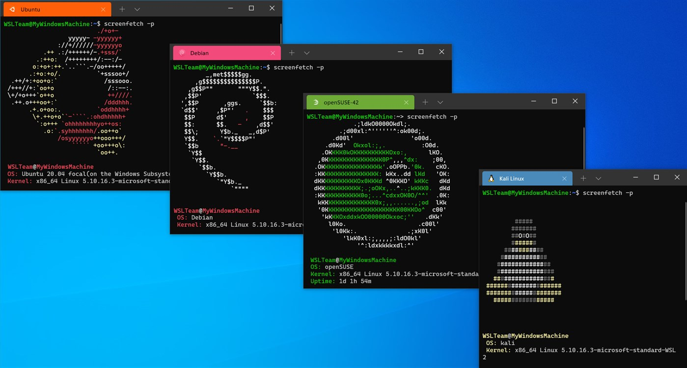

# WSL Automated Setup

<table>
    <tr>
        <td>
The WSL Automated Setup project is a set of scripts that can make the installation and creation of custom distros for WSL a simple process. It allows a user to create a custom WSL install and tear it down again when no longer needed or broken. 

The purpose of the scripts in this repo are to make the creation of development ready WSL distros easy by 
automating the creation of a custom distro using Docker containers.
    </td>
    <td>
    
        </td>
    </tr>
</table>

___
## Installation Instructions

> ### Prerequisites
> For the installation you will need the following:
> - Git (If cloning the repository)
### If WSL is enabled already
If you have got WSL and WSL2 enabled already on your computer and you have Docker Desktop installed you simply
need to run the ***"init.ps1"*** file in this folder. This script will build a Docker container using a
Dockerfile which installs the required for sysadmin / k8s admin  eg... kubernetes cli, ansible, helm, sops etc.   ***If the tar file "dev-env.tar.gz" already exists from previous runs it will be used instead of recreating it.***

If for whatever reason you want to remove the installed WSL distro you can run the ***"destroy.ps1"***
which will remove the distro and the network configurations. To re-install the custom WSL distro again just 
re-run the init.ps1 and it will install a fresh distro.
___
### If WSL is not already enabled on your computer
If you have not got WSL enabled and you are using Windows 10 version 2004 or higher the init.ps1 script will detect and install it for you. You are then required to reboot and rerun the init.ps1 script. 

This command will enable all of the required components, download the latest Linux kernel and set WSL 2 as your default.

***For more information check the official documentation below***

> https://docs.microsoft.com/en-us/windows/wsl/install

**Customisation** 
For those who want to customise or adjust the image in any way, simply build out the bootstrap.sh file in the resources folder. 